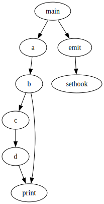

# Lua Call Graph

Generate a call graph of Lua programs.

## API

### capture

**syntax**: *graph.capture(name)*

Starts capturing the call graph from that point in the program.

### emit

**syntax**: *graph.emit(name, filename)*

Emits the captured call graph named `name` into the DOT file `filename`.

## Example

Given the Lua code below
```lua
local graph = require"graph"

function a()
  b()
end

function b()
  c()
  print()
end

function c()
  d()
end

function d()
  print("")
end

graph.capture("g")
a()
graph.emit("g", "graph.dot")
```

the library outputs the following call graph:


