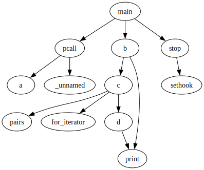

# Lua Call Graph

Generate a call graph of Lua programs.

## API

### new

Create new capture instance.

**syntax**: graph.new(cfg)

Supported configs:
* `name`: call graph name
* `filename`: name for the call graph `.dot` file (defaults to `name`)

### :capture

**syntax**: *graph:capture()*

Starts capturing the call graph from that point in the program.

### :stop

**syntax**: graph:stop()

Stops capturing the call graph. A subsequent call to `:emit` generates the
call graph.

### :emit

**syntax**: *graph:emit()*

Emits the captured call graph named `name` into the DOT file `filename`.

## Example

Given the Lua code below
```lua
local graph = require"graph"

function a()
  b()
end

function b()
  c()
  print()
end

function c()
  d()
end

function d()
  print("")
end

local g = graph.new({
  name = "callgraph",
  filename = "graph.dot",
})

g:capture()
a()
g:stop()
c()
g:emit()
```

the library outputs the following call graph:


